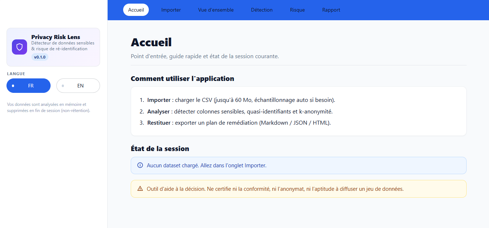

# Privacy Risk Lens

[English](README.md) | Français

Privacy Risk Lens est une application qui aide à examiner des fichiers CSV à la recherche de colonnes potentiellement sensibles et à estimer le risque de ré-identification. Elle accompagne les revues de confidentialité et de gouvernance des données; elle ne certifie ni la conformité, ni l’anonymat, ni l’aptitude à diffuser un jeu de données.




## Sommaire

- [Fonctionnalités](#fonctionnalités)
- [Lancer l’application en local](#lancer-lapplication-en-local)
- [Utiliser l’application](#utiliser-lapplication)
- [Méthode et interprétation](#méthode-et-interprétation)
- [Traitement des données et limites](#traitement-des-données-et-limites)
- [Configuration](#configuration)
- [Docker et Render](#docker-et-render)
- [Organisation du projet](#organisation-du-projet)
- [Licence](#licence)
- [Auteur](#auteur)

## Fonctionnalités

- Import de fichiers CSV jusqu’à 60 Mo, avec détection automatique de l’encodage et du séparateur.
- Aperçu masqué et profil des colonnes avant l’analyse.
- Repérage de colonnes susceptibles de contenir des e-mails, numéros de téléphone, noms, adresses, identifiants, données de santé ou quasi-identifiants.
- Consultation des signaux et du niveau de confiance associés à chaque classification, avec un indicateur de PII inline pour certains champs de texte libre.
- Estimation de la k-anonymité à partir des quasi-identifiants et des adresses détectés; suggestions de généralisation sans modification du fichier source.
- Export des résultats en Markdown, JSON ou HTML. Les rapports contiennent des exemples masqués et n’incluent pas les lignes source.
- Interface disponible en français et en anglais.

## Lancer l’application en local

Sous Windows PowerShell :

```powershell
py -3.11 -m venv .venv
.\.venv\Scripts\Activate.ps1
python -m pip install -r requirements.txt
streamlit run app.py
```

Sous macOS ou Linux :

```sh
python3 -m venv .venv
. .venv/bin/activate
python -m pip install -r requirements.txt
streamlit run app.py
```

## Utiliser l’application

1. Dans **Importer**, sélectionnez un fichier CSV comportant une ligne d’en-tête.
2. Vérifiez l’encodage et le séparateur détectés, l’aperçu masqué et le profil des colonnes.
3. Sélectionnez **Lancer l’analyse** pour calculer les détections et les résultats de risque.
4. Consultez **Vue d’ensemble**, **Détection** et **Risque**. L’onglet **Rapport** permet de télécharger un export Markdown, JSON ou HTML.
5. Utilisez **Effacer le dataset et les résultats** dans l’onglet Importer pour supprimer le jeu de données courant et son analyse de la session.

La taille maximale d’un fichier importé est fixée à 60 Mo dans `.streamlit/config.toml`. Au-delà du seuil de lecture complète, l’application utilise un échantillonnage systématique. Les valeurs par défaut sont de 300 000 lignes pour une lecture complète et de 200 000 lignes au maximum pour l’échantillon. Les variables `PRL_MAX_ROWS_FULL` et `PRL_SAMPLE_N` permettent de modifier ces seuils. L’échantillonnage réduit le volume conservé pour l’analyse; le nombre total de lignes affiché reste celui du fichier source.

## Méthode et interprétation

**Détection des colonnes.** Le moteur combine des motifs appliqués aux noms normalisés, les types pandas, le taux d’unicité et des motifs de contenu. La recherche dans les valeurs est heuristique et ne constitue pas une détection exhaustive des données personnelles. Dans les colonnes de texte libre suffisamment longues, certaines correspondances peuvent activer l’indicateur PII inline sans classer toute la colonne comme sensible. La détection examine au plus 2 000 valeurs échantillonnées par colonne.

**Risque de ré-identification.** Les lignes sont regroupées selon les quasi-identifiants et adresses détectés. L’application calcule la taille minimale d’un groupe (`k-min`) et la proportion des lignes analysées appartenant à un groupe de taille un. Un `k-min` inférieur à 5 correspond à un niveau de risque élevé; inférieur à 10, à un niveau moyen. Les résultats portent sur les données analysées, qui peuvent être un échantillon du fichier complet.

**Suggestions de généralisation.** Certains noms de colonnes déclenchent des suggestions telles que l’année, une tranche d’âge, les deux premiers chiffres d’un code postal ou une zone géographique plus large. Ces transformations sont indicatives: l’application ne les applique pas au jeu de données, et une hausse du k estimé ne prouve pas l’anonymat.

Le score global est un indicateur heuristique, pas une garantie statistique. Examinez les détections sous-jacentes et le contexte du jeu de données avant toute décision.

## Traitement des données et limites

Le jeu de données chargé et ses résultats restent dans la mémoire du processus, au sein de la session Streamlit courante. L’application ne met pas en œuvre de stockage persistant des datasets et propose une action pour effacer les données de session. Cela ne signifie pas qu’un déploiement hébergé équivaut à un traitement local: le fichier est transmis au serveur qui exécute Streamlit et relève des règles d’accès, de journalisation, de sauvegarde et de conservation de cet hébergeur. Ne transmettez pas de données confidentielles ou réglementées à une instance publique sans validation préalable de son hébergement.

La détection repose sur des règles et peut produire des faux positifs ou des faux négatifs. Elle dépend des noms de colonnes, des types, de l’unicité et d’un échantillon limité de valeurs; elle ne vérifie ni la base légale, ni le consentement, ni la conformité réglementaire. La k-anonymité est une mesure de risque parmi d’autres et ne prouve pas qu’une ré-identification est impossible. Une revue de confidentialité adaptée, notamment une AIPD lorsque nécessaire, reste indispensable.

## Configuration

| Paramètre | Valeur par défaut | Rôle |
| --- | ---: | --- |
| `PRL_MAX_ROWS_FULL` | `300000` | Lire tout le CSV jusqu’à ce nombre de lignes de données. |
| `PRL_SAMPLE_N` | `200000` | Nombre maximal de lignes conservées pour l’échantillonnage d’un fichier plus grand. |
| `server.maxUploadSize` | `60` Mo | Limite d’import Streamlit définie dans `.streamlit/config.toml`. |

## Docker et Render

Construire et lancer l’image Docker :

```sh
docker build -t privacy-risk-lens .
docker run --rm -p 8501:8501 privacy-risk-lens
```

Le conteneur exécute Streamlit avec un utilisateur non privilégié. Le fichier `render.yaml` décrit un service web Render basé sur Docker, avec une vérification de santé Streamlit et le déploiement automatique depuis la branche configurée. Vérifiez les exigences d’hébergement et de traitement des données avant d’y charger des données réelles.

## Organisation du projet

| Chemin | Rôle |
| --- | --- |
| `app.py` | Point d’entrée Streamlit et parcours des pages. |
| `core/io.py` | Détection, comptage, chargement et échantillonnage CSV. |
| `core/detection.py` | Classification des colonnes et exemples masqués. |
| `core/risk.py` | K-anonymité, suggestions de généralisation et scores de risque. |
| `core/report.py` | Génération des rapports Markdown, JSON et HTML. |
| `i18n/` | Catalogues de traduction français et anglais. |
| `ui/` | Feuille de style, templates et icônes partagés. |
| `Dockerfile`, `render.yaml` | Configuration du conteneur et du déploiement Render. |
| `LICENSE` | Conditions de la licence MIT. |

## Licence

Ce projet est distribué sous licence MIT. Consultez le fichier [LICENSE](LICENSE) pour en connaître les conditions complètes.

## Auteur

Maxime NDACLEU - Data Analyst & BI


