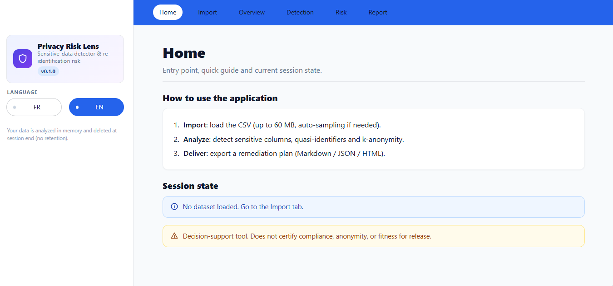

# Privacy Risk Lens

English | [Français](README.fr.md)

Privacy Risk Lens is a Streamlit application for reviewing CSV datasets for potentially sensitive columns and estimating re-identification risk. It is intended to support privacy and data-governance reviews; it does not certify compliance, anonymity, or fitness for release.




## Contents

- [Capabilities](#capabilities)
- [Run locally](#run-locally)
- [Use the application](#use-the-application)
- [How the estimates work](#how-the-estimates-work)
- [Data handling and limitations](#data-handling-and-limitations)
- [Configuration](#configuration)
- [Docker and Render](#docker-and-render)
- [Project structure](#project-structure)
- [License](#license)
- [Autor](#autor)

## Capabilities

- Import CSV files up to 60 MB. Encoding and delimiter are detected automatically.
- Review a masked preview and a profile of each column before analysis.
- Flag likely emails, phone numbers, names, addresses, identifiers, health-related fields, and quasi-identifiers.
- Inspect the signal and confidence behind each column classification, including an inline-PII flag for some free-text fields.
- Estimate k-anonymity over detected quasi-identifiers and addresses, and review possible generalizations without changing the source dataset.
- Export a report as Markdown, JSON, or HTML. Reports include masked examples and do not include the source rows.
- Switch the interface between French and English.

## Run locally

On Windows PowerShell:

```powershell
py -3.11 -m venv .venv
.\.venv\Scripts\Activate.ps1
python -m pip install -r requirements.txt
streamlit run app.py
```

On macOS or Linux:

```sh
python3 -m venv .venv
. .venv/bin/activate
python -m pip install -r requirements.txt
streamlit run app.py
```

## Use the application

1. Open **Import** and select a CSV file with a header row.
2. Check the detected encoding, delimiter, masked preview, and column profile.
3. Select **Run analysis** to calculate column detections and risk results.
4. Review **Overview**, **Detection**, and **Risk**. Use **Report** to download Markdown, JSON, or HTML.
5. Use **Clear dataset and results** on the Import page to remove the current dataset and its analysis from the session.

The upload widget is limited to 60 MB by `.streamlit/config.toml`. For datasets larger than the configured full-read threshold, the application uses systematic row sampling. Defaults are 300,000 rows for a full read and a maximum sample of 200,000 rows. Set `PRL_MAX_ROWS_FULL` and `PRL_SAMPLE_N` to change these thresholds. Sampling reduces the amount of data held for analysis, but the reported totals still refer to the source CSV.

## How the estimates work

**Column detection.** The detector combines normalized column-name patterns, pandas data types, uniqueness, and content patterns. Content matching is heuristic and is not a comprehensive scan for personal information. For sufficiently long free-text columns, matching values can set an inline-PII flag without classifying the entire column as sensitive. At most 2,000 values per column are sampled for detection.

**Re-identification risk.** The application groups rows by detected quasi-identifiers and addresses. It reports the minimum group size (`k-min`) and the proportion of analyzed rows that occur in groups of size one. A `k-min` below 5 is rated high risk; below 10 is rated medium risk. Results describe the analyzed data, which may be a sample rather than the full file.

**Generalization suggestions.** Supported column-name patterns can produce suggestions such as year, age band, two-digit postal prefix, or broader geography. These are illustrative transformations: the application does not apply them to the dataset, and a higher estimated k does not establish anonymity.

The overall score is a heuristic summary, not a statistical guarantee. Review the underlying detections and the dataset context before acting on it.

## Data handling and limitations

The application keeps the parsed dataset and analysis in the current Streamlit session's process memory. It does not implement persistent dataset storage, and the Import page provides an action to clear the session data. This does not mean that a hosted deployment is equivalent to local processing: uploaded files are sent to the server running Streamlit and are subject to that host's access controls, logs, backups, and retention policies. Do not upload confidential or regulated data to a public instance unless its deployment has been reviewed and approved for that use.

Detection is rule-based and can produce false positives or false negatives. It relies on column names, data types, uniqueness, and a limited sample of values; it does not validate legal bases, consent, or regulatory compliance. K-anonymity is only one risk measure and should not be treated as proof that re-identification is impossible. Use an appropriate privacy review, including a DPIA where applicable.

## Configuration

| Setting | Default | Purpose |
| --- | ---: | --- |
| `PRL_MAX_ROWS_FULL` | `300000` | Read the complete CSV up to this number of data rows. |
| `PRL_SAMPLE_N` | `200000` | Maximum number of rows to retain when sampling a larger CSV. |
| `server.maxUploadSize` | `60` MB | Streamlit upload limit in `.streamlit/config.toml`. |

## Docker and Render

Build and run the Docker image:

```sh
docker build -t privacy-risk-lens .
docker run --rm -p 8501:8501 privacy-risk-lens
```

The image runs Streamlit as an unprivileged user. The included `render.yaml` describes a Docker-based Render web service with a Streamlit health check and automatic deploys from the configured branch. Review the hosting plan and data-handling requirements before deploying real datasets.

## Project structure

| Path | Purpose |
| --- | --- |
| `app.py` | Streamlit entry point and page workflows. |
| `core/io.py` | CSV detection, record counting, loading, and sampling. |
| `core/detection.py` | Column classification and masked examples. |
| `core/risk.py` | K-anonymity, generalization suggestions, and risk scores. |
| `core/report.py` | Markdown, JSON, and HTML report generation. |
| `i18n/` | French and English translation catalogs. |
| `ui/` | Shared stylesheet, templates, and icons. |
| `Dockerfile`, `render.yaml` | Container and Render deployment configuration. |
| `LICENSE` | MIT license terms. |

## License

This project is licensed under the MIT License. See [LICENSE](LICENSE) for the full terms.

## Autor

Maxime NDACLEU - Data Analyst & BI


